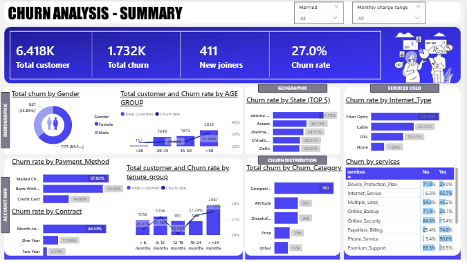

# 📊 Customer Churn Analysis – Data Analytics Project

## 📌 Overview

Customer Churn Analysis is an end-to-end data analytics project focused on identifying churn patterns, customer distribution trends, and revenue impact using structured SQL analysis and interactive dashboards.

This project demonstrates how raw customer data is cleaned, transformed, and analyzed using **MySQL**, and how business insights are visualized through **Power BI dashboards** for business decision-making.

---

## 📁 Dataset

- Telecom customer dataset containing structured customer information  
- Imported and processed using **MySQL**  
- Used to analyze:  
  - Customer distribution  
  - Revenue contribution  
  - Contract-based segmentation  
  - Customer lifecycle status (Joined, Stayed, Churned)  

---

## 🛠 Tools & Technologies

- **MySQL** – Data cleaning, transformation, and SQL analysis  
- **MySQL Workbench** – Database management and query execution  
- **Power BI** – Interactive dashboard and KPI visualization  

---

## 🔄 Project Workflow / Steps

### 1️⃣ Data Import

- Imported raw dataset into MySQL (`customerdata` table)  
- Verified data structure and row count  

### 2️⃣ Data Cleaning

- Converted blank values to `NULL` using `NULLIF(TRIM(column), '')`  
- Checked null counts using `CASE WHEN`  
- Replaced missing values using `IFNULL()`  
- Created a cleaned production table: `prod_churn`  

### 3️⃣ View Creation

- Created `vw_churndata` for Churned and Stayed customers  
- Created `vw_joindata` for Joined customers  

### 4️⃣ SQL Analysis

- Calculated gender-wise customer distribution and percentage  
- Analyzed contract-wise customer segmentation  
- Computed state-wise customer percentage (ordered by highest share)  
- Measured revenue contribution by customer status  
- Performed KPI calculations using subqueries and aggregate functions  

### 5️⃣ Dashboard Development (Power BI)

- Connected MySQL database to Power BI  
- Designed KPI cards (Total Customers, Total Revenue, Churn Rate)  
- Created interactive visuals for segmentation analysis  
- Added slicers for dynamic filtering  

---

## 📈 Dashboard

The Power BI dashboard includes:

- Customer distribution by Gender and State  
- Contract type analysis  
- Revenue contribution by Customer Status  
- KPI metrics for churn analysis  
- Interactive filters for stakeholder exploration

  > 

---

## 📊 Results & Insights

- Customer distribution varies across contract types and states  
- Revenue contribution differs between churned and retained customers  
- Segmentation by customer status improves churn behavior analysis  
- Dashboard provides business-ready churn insights  

---

## ▶️ How to Run the Project

### 1️⃣ Clone the repository

git clone https://github.com/anushka-2004/Churn_analysis.git

### 2️⃣ Import Dataset into MySQL

- Create database and table  
- Load dataset into `customerdata`  

### 3️⃣ Execute Data Cleaning Queries

- Run NULL handling and transformation queries  
- Create `prod_churn` table  
- Create analytical views  

### 4️⃣ Open Power BI

- Connect to MySQL database  
- Load `prod_churn`  
- Explore the dashboard  

---

## 📌 Key Takeaway

This project demonstrates strong SQL fundamentals, structured data cleaning, KPI calculation, view creation, and the ability to convert raw customer data into actionable business intelligence using Power BI.
